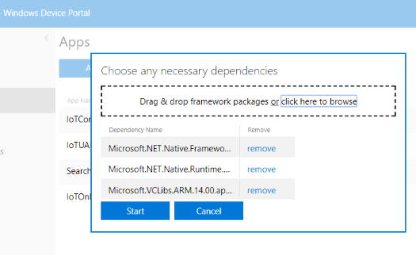

1. Create a package in Visual Studio.

    
    
    This will place the packages in \Client\Dinmore.Uwp\AppPackages.

1. Open the device portal from the Windows IoT dashboard.
 
    

1. Open the Apps menu in the device portal and select "Add".

    
    
1. Then select the bundle you have just created in \Client\Dinmore.Uwp\AppPackages.  The bundle depends on some other frameworks so at least for the first install you will have to upload the dependencies as well so select "I want to specify framework packages".

       
    
1. The relevant packages for the target platform are in a subdirectory below the package, so select them all.

    
    
1. Once the package is intalled it should be listed in the Apps, but not set as the startup application.  It might be tempting to delete IoTCoreDefaultApp as a housekeeping measure.  The application contains a browser and various other useful bits and pieces.  When connecting to a public network which requires browser authentication these will come in handy so I suggest you leave it.

       
    
1. Set the Black Radley Intelligent Exhibit as the startup application.

    
    
1. Then reboot the device.

    

    If the reboot doesn't work, turn it off and on again instead.

Now proceed to [on boarding]({{ site.baseurl }}/onboarding) to create the device data entry and associate the physical device with it. This is required before the device can start using the patrons API.
